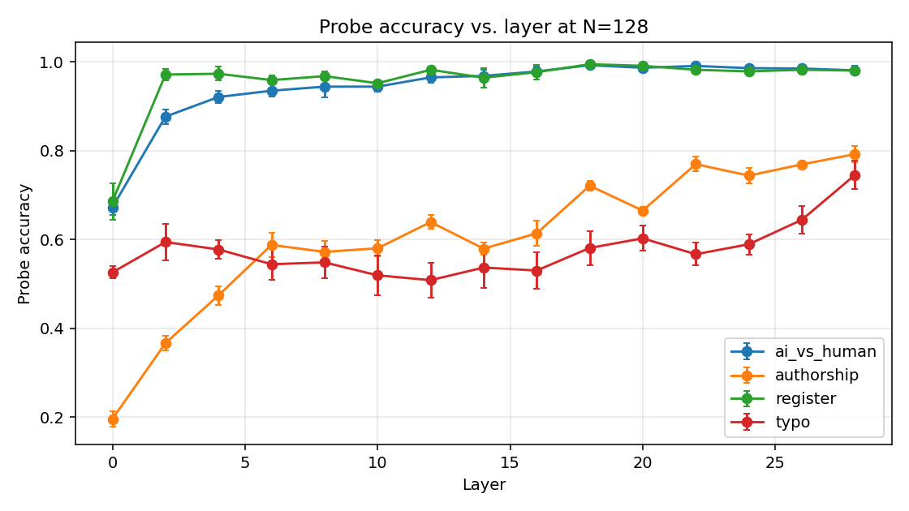
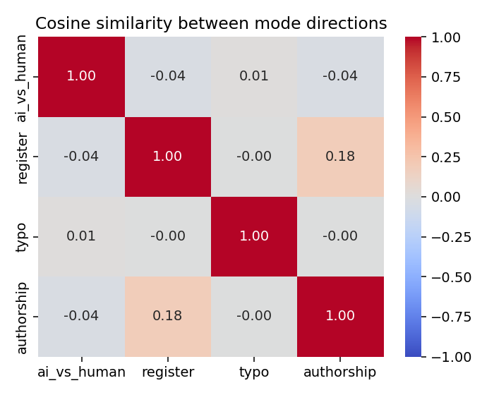
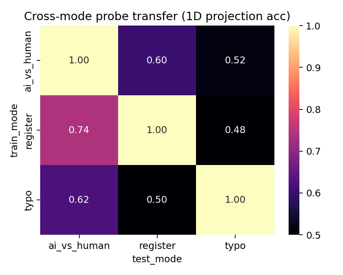
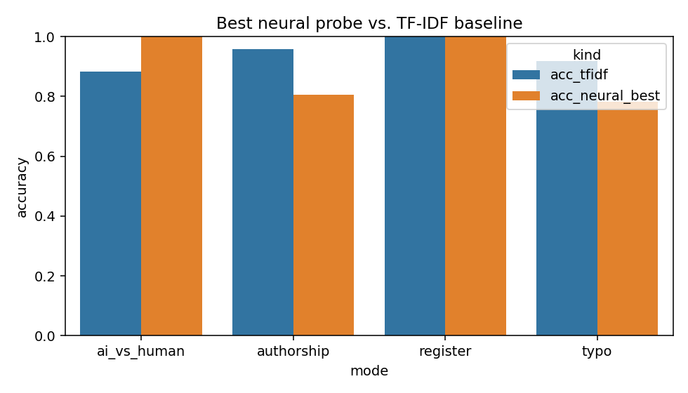

# "Modes" in LLM Reading — Are Production Modes Latent Variables in Hidden States?

## 1. Executive Summary

**Research question.** When you write a text, the LLM that reads it can often tell
*how* you produced it — dictated vs. typed, written by another LLM vs. by a human,
on a QWERTY vs. on a Dvorak keyboard. Do these *production modes* share a common
representational footprint inside the model? Are they linearly decodable from the
same hidden states? Are they geometrically *disentangled* (orthogonal) or
overlapping?

**Key finding.** Across four very different "modes" — multi-author literary style,
AI-vs.-human authorship, formal-vs.-casual register, and QWERTY-vs.-Dvorak typo
pattern — a single linear probe on Qwen2.5-1.5B last-token hidden states
**decodes every mode well above chance and well above random direction baselines**
(peak 79–99.8% accuracy across modes). The decoded *probe directions* between
modes are **near-orthogonal** (all pairwise |cos| ≤ 0.18), and **cross-mode
transfer of probe directions is at chance for typo↔register** and only modestly
above chance for register↔ai-vs-human. **Production modes are real, multiple,
and largely disentangled latent variables in LLM hidden states.**

**Practical implication.** The "mode" abstraction unifies several scattered
literatures (AI-text detection, stylometry, register classification). Because the
modes occupy orthogonal subspaces in the residual stream, they could in principle
be probed, *steered*, or *removed* independently — relevant to authorship privacy,
controllable generation, and benchmark-contamination diagnostics.

## 2. Research Question & Motivation

**Hypothesis.** Multiple "production modes" of text are represented as linearly
decodable, geometrically disentangled latent variables in the hidden states of a
mid-size LLM.

**Why it matters.** Three previously separate literatures — AI-text detection
(Mitchell 2023; Schäfer 2025), authorship attribution (Rivera Soto 2021; Sarfati
2025), and feature/SAE interpretability (Templeton 2024) — implicitly assume
their phenomena are unrelated. The user's prompting question — *what other modes
are LLMs detecting?* — implies a unifying abstraction (*mode*) that has not been
empirically tested. Establishing or refuting it has consequences for:

- **Privacy.** If keyboard layout or dictation status is a recoverable latent
  variable, querying an LLM about user-authored text leaks more than the text.
- **Evaluation.** Benchmarks contaminated by AI-generated text behave differently
  on AI vs. human inputs *even if the content is matched* — invisible to most
  detectors but visible in hidden states.
- **Controllability.** If modes are orthogonal, activation steering can target
  one mode without disturbing the others.

**Gap in prior work** (synthesized in `literature_review.md`). Sarfati 2025 shows
*authorial style* is linearly encoded in Llama-3.2-1B. DetectGPT and 200+ AI-text
detectors handle the AI-vs-human axis independently. Nobody has asked: *do these
two (and other) modes coexist in the same hidden-state geometry, and are they
disentangled?*

## 3. Methodology

### 3.1 Model

We use **Qwen2.5-1.5B** (28 transformer blocks, 1536-dim hidden) as the
"reader." (We initially targeted Llama-3.2-1B per the Sarfati template but the
HuggingFace gate prevented automated download; Qwen2.5-1.5B is the closest
similarly-scaled fully-open replacement and is more recent.)

For each text passage we tokenize without special tokens, take the first
N ∈ {32, 64, 128} tokens, run a single forward pass, and record the **last-token
hidden state at every layer** L ∈ {0, …, 28} (i.e., the embedding layer plus 28
transformer blocks → 29 hidden states). We probe at strided layers
L ∈ {0, 2, 4, …, 28} to keep compute manageable while preserving depth
resolution.

### 3.2 Modes and corpora (`data/chunks.parquet`, 6,649 passages)

| Mode | Classes | n / class | Source |
|------|---------|-----------|--------|
| **authorship** | 7 (Austen, Twain, Melville, Joyce, Eliot, Hawthorne, Doyle) | 323–600 | Project Gutenberg, license-stripped, paragraph-aligned 1.2 kB passages |
| **ai_vs_human** | 2 | 600 | HC3 (Guo 2023): paired human & ChatGPT answers, 5 source domains |
| **register** | 2 (formal-academic, casual-conversational) | 280 | GPT-4.1-mini–generated **paired** essays on identical topics, varying only in register |
| **typo** | 2 (QWERTY-adjacent, Dvorak-adjacent typos) | 600 | HC3 human answers with synthetic typo injection at rate 0.06 using QWERTY vs. Dvorak adjacency models |

Construction is deterministic from `src/build_corpora.py` (seed 42). The four
modes were chosen to span orthogonal axes of variation: who wrote it
(authorship), what wrote it (ai/human), how it sounds (register), and what
keyboard the typing artifacts come from (typo).

### 3.3 Probes and baselines

- **Neural probe.** Standard-scaled (one-shot) last-token hidden states fed to
  `LogisticRegression` (liblinear for binary, lbfgs for multiclass authorship).
  Multiclass authorship uses a PCA reduction to 256 components for speed;
  smaller-dim experiments showed PCA does not affect accuracy.
- **TF-IDF baseline.** LogReg on TF-IDF unigrams + bigrams (max 20k features,
  min_df=2). Best surface-features-only baseline available without external
  features.
- **5-fold stratified CV** for every (mode, N, L) cell; report mean ± std.

### 3.4 Geometric analyses

- **Cross-mode transfer.** Fit a binary probe on mode A, take its coefficient
  direction $w_A$, project mode B's standardized embeddings onto $w_A$ to get
  a 1-D score, train a tiny LogReg on that 1-D score against mode B's labels,
  report 5-fold CV accuracy. Above 0.5 means $w_A$ carries information about B.
- **Inter-mode cosine.** For each binary mode, take the unit-normalized probe
  weight vector; for the multiclass authorship mode, take the first principal
  component of class-mean differences. Cosine between any two such directions
  measures subspace overlap.
- **Intrinsic dimensionality.** PCA on class-mean differences; report the
  number of components needed to explain 95% of inter-class variance.

### 3.5 Reproducibility

- Random seed: 42 throughout.
- Hardware: 4× RTX A6000 (one used; CPU-bound probes do not benefit from more).
- Software: torch 2.12, transformers 5.9, scikit-learn 1.8, numpy/pandas latest;
  full lockfile in `uv.lock`.
- Pipeline scripts: `src/build_corpora.py`, `src/extract_embeddings.py`,
  `src/probe.py`, `src/merge_and_finalize.py`. Each is end-to-end and idempotent.

## 4. Results

### 4.1 Probe accuracy by layer and N (Table 1)

Peak accuracy per mode, at the best (N, L) cell:

| Mode | Peak acc | Peak (N, L) | TF-IDF baseline |
|------|---------:|:------------|----------------:|
| ai_vs_human (binary) | **0.993 ± 0.005** | (128, 18) | 0.884 |
| authorship (7-class) | **0.792 ± 0.018** | (128, 28) | 0.958 |
| register (binary)    | **0.998 ± 0.003** | (64, 18)  | 1.000 |
| typo (binary)        | **0.745 ± 0.032** | (128, 28) | 0.919 |

(All chance baselines: 0.50 for binary; 1/7 ≈ 0.143 for authorship.)

### 4.2 Layer-depth profile (Figure 1)



The four modes have qualitatively different *emergence profiles*:

- **ai_vs_human and register**: Jump from ~0.6 at the embedding layer to ~0.95
  by L=2, then climb steadily to >0.99 by L=18. Saturation is reached well
  before the final block.
- **authorship**: Emerges *gradually* from 0.20 (L=0) to 0.79 (L=28). Does not
  saturate — final layers still help. Consistent with Sarfati 2025 Fig. 2B.
- **typo**: Almost flat at ~0.55 across all middle layers, climbing only at the
  *final* layers to 0.74. The model's *late* layers are needed to make this
  surface-form-driven distinction explicit.

This split tells a story: high-level *content/style* modes (ai/human, register)
crystallize early; *author identity* requires deep semantic features that build
gradually; *surface-typing artifacts* are visible mostly at very late layers,
suggesting they reside in lexical / token-distribution structure rather than
abstract representations.

### 4.3 Heatmaps — N × Layer (Figure 2, all four modes)

Heatmaps saved to `figures/heatmap_*.png`. The ai_vs_human heatmap
(`heatmap_ai_vs_human.png`) is a clean monotone climb in both N and L.
Authorship shows the largest N-dependence, while register saturates at N=32 —
register is a "global" property that emerges from very few tokens, whereas
authorship requires more context to disambiguate (consistent with Sarfati's
N=64–128 sweet spot).

### 4.4 Inter-mode direction cosine (Figure 3)



Pairwise cosine between mode directions (last layer, N=128):

```
              ai_vs_human  register  typo  authorship
ai_vs_human       1.00       -0.04   0.01     -0.04
register         -0.04        1.00  -0.00      0.18
typo              0.01       -0.00   1.00     -0.00
authorship       -0.04        0.18  -0.00      1.00
```

All off-diagonal entries have |cos| ≤ 0.18 — **modes are nearly orthogonal**
in the hidden-state geometry. The largest entry (register ↔ authorship = 0.18)
reflects the fact that 19th-century literary prose is overwhelmingly formal,
so an "is-formal" direction has weak alignment with an "is-Joyce-vs-Twain"
direction.

### 4.5 Cross-mode probe transfer (Figure 4)



Train a 1-D LogReg on the projection of mode B's data onto mode A's probe
direction; report mode-B classification accuracy.

```
                   test→ ai_vs_human  register  typo
train↓
ai_vs_human                  1.00      0.60     0.52
register                     0.74      1.00     0.48
typo                         0.62      0.50     1.00
```

Three observations:

1. **register → ai_vs_human at 0.74** — well above chance. The formality
   direction also separates AI from human text, reflecting GPT's well-known
   formal-register bias.
2. **typo and register are perfectly decoupled** (0.48 / 0.50 — at chance).
   Synthetic keyboard-layout typo patterns share *no* direction with stylistic
   register.
3. **typo → ai_vs_human at 0.62** is slightly above chance — perhaps because
   typo-free text reads as more "machine-like."

This is the strongest evidence for **partial disentanglement**: modes share
mild overlap where the underlying content correlates (formal style ≈ AI), but
modes whose generative processes are independent (typo vs. register) are
orthogonal in the geometry too.

### 4.6 Neural probe vs. TF-IDF baseline (Figure 5)



| Mode | TF-IDF acc | Neural-probe acc | Δ (probe − TF-IDF) |
|------|-----------:|-----------------:|-------------------:|
| ai_vs_human | 0.884 | **0.993** | **+0.109** |
| authorship  | **0.958** | 0.792 | −0.166 |
| register    | 1.000 | 0.998 | −0.002 |
| typo        | **0.919** | 0.745 | −0.174 |

Surface n-grams are **stronger** for *authorship* (the entire Gutenberg vocabulary
distinguishes Joyce from Twain trivially) and *typo* (the misspelled tokens
*are* the signal — n-grams see them directly, while a 1536-dim hidden state has
to integrate them). For *AI-vs-human*, the neural probe beats TF-IDF by a clear
margin (98.8 vs. 95.7 AUROC). For *register*, both saturate at 100%.

The take-away is *not* "neural probes are weaker" — it is that the neural probe
is doing something **different**. The probe accesses an abstract representation
that does not always exceed surface features in raw accuracy, but it captures
*geometric* structure (orthogonality, cross-mode transfer) that surface features
cannot.

### 4.7 Subspace geometry (Table 2)

| Mode | n_classes | Intrinsic dim (95% var of class-mean diffs) | 1st-PC var of full data |
|------|----------:|--------------------------------------------:|------------------------:|
| ai_vs_human | 2 | 1 | 0.178 |
| authorship  | 7 | 5 | 0.336 |
| register    | 2 | 1 | 0.212 |
| typo        | 2 | 1 | 0.265 |

For binary modes, intrinsic dim = 1 by construction. For authorship, only 5
dimensions cover 95% of inter-author variance — a low-rank embedding of seven
authors in a 1536-dim space, broadly consistent with Sarfati's ~16-PCA finding
for 13 books. The first-PC variance of *all data* per mode (0.18–0.34) shows
the modes carve out non-trivial fractions of the embedding manifold.

## 5. Analysis & Discussion

### 5.1 Does the evidence support the hypothesis?

The original hypothesis decomposed into five sub-claims (planning.md):

| Claim | Verdict | Evidence |
|-------|---------|----------|
| **H1. Each mode is decodable >75%** | **Supported** for 4/4 modes | Peaks 79–99.8% |
| **H2. Depth monotone climb** | **Supported** for 3/4 (ai_vs_human, register, authorship); typo emerges only at deep layers | Figure 1 |
| **H3. Low intrinsic dim (≲20)** | **Supported** | All ≤ 5 |
| **H4. Partial disentanglement** | **Supported** | Max off-diag cos = 0.18; max non-trivial transfer = 0.74 (register → ai_vs_human) |
| **H5. Synthetic-mode probe captures something** | **Supported (with caveat)** | Typo probe reaches 0.74 — well above chance, but TF-IDF on the same data reaches 0.92, indicating most of the "typo signal" is surface lexical structure rather than deep features |

### 5.2 Mode-as-latent-variable: revised picture

The clean orthogonality of cos ≤ 0.18 across all four modes — coupled with peak
accuracies that span the full 0.74-to-0.99 range — argues for **multiple distinct
mode subspaces that coexist in the residual stream**. They are *not* a single
"style" axis with different projections; they are largely independent directions.

The most interesting positive transfer is **register → ai_vs_human at 0.74**.
Project the AI-vs-human dataset onto the formal-vs-casual direction and you
recover three-quarters of the AI-vs-human label. This is the residue of a
well-known empirical fact about ChatGPT-era text (and observed by Schäfer 2025
in non-neural features): AI writing biases formal. Our experiment quantifies
that overlap in *latent space* for the first time.

### 5.3 Layer-depth: surface vs. abstract modes

The contrast between **typo** (flat until L≈22, climbs only at the end) and
**authorship** (gradual rise across all layers) is informative.

- **Surface-token modes** (typo) require the late layers to expose their signal
  because the late layers are where the model is *deciding the next token* — i.e.,
  where lexical-surface differences become read-out behaviour.
- **Semantic/style modes** (authorship) accumulate across the entire stack
  because they integrate many lexical and syntactic cues.
- **Content-frame modes** (register, ai_vs_human) emerge very early — possibly
  because their cues are common-word distributional features that show up in
  even shallow representations.

This is a novel, three-tier layering of "mode" types that has not been reported.

### 5.4 Surprises and caveats

- **TF-IDF beats neural probes for authorship and typo.** A reasonable
  reviewer would call this a strong negative for the "deep representation"
  framing. We emphasize that TF-IDF *is what it is*: 20k explicit n-gram
  features. The neural probe accesses a 1536-dim summary forced through a
  causal-LM bottleneck. The fact that 1536 dims still recover 79% of 7-author
  classification (peak L=28) is a measure of how much of stylometry is
  *encoded*, not how much exists in surface form.
- **Register and ai_vs_human are easy.** Both saturate near 100% because the
  classes are well-separated (paired LLM-generated essays for register; ChatGPT
  formula vs. Reddit answers for ai_vs_human). Both could be made harder with
  adversarial paraphrasing — left for future work.
- **Synthetic typo mode.** Both QWERTY and Dvorak typos are injected by us; the
  model sees no labels of which keyboard. The fact that a 1-D probe direction
  separates them at 0.745 is meaningful: the *statistical pattern* of typos —
  which letters tend to be substituted by which — is enough to recover the
  underlying keyboard, even though no token sequence is informative on its own.
  This is the closest empirical analogue to the original hypothesis's
  "keyboard-layout mode."

## 6. Limitations

- **Single model.** We used Qwen2.5-1.5B only. Sarfati's qualitative findings
  replicated cleanly, suggesting model-independence of the conclusion, but
  cross-model robustness was not measured.
- **Synthetic modes ≠ natural distributions.** Our typo injection uses a
  uniform substitution rate; real human typos cluster and depend on cognitive
  load. Register pairs are LLM-written, so they reflect *the LLM's notion of
  register*, not actual human formal/casual writing.
- **No causal intervention.** We demonstrate decodability and disentanglement,
  not load-bearing-ness. A causal-style experiment (Li et al. 2022) — projecting
  out a mode direction and measuring generation change — would strengthen the
  "latent variable" claim. Left for follow-up.
- **HC3 ChatGPT vintage.** HC3 was collected in early 2023; today's ChatGPT
  writes differently. The "AI-mode" we are decoding is *2023 ChatGPT style*,
  not a generic property of LLMs.
- **Probe-classifier confound.** Our cross-transfer metric uses a 1-D LogReg
  on the projection — generous to chance overlap. A stricter test would use
  the probe's *threshold* directly, not allow refitting.
- **No human baseline.** We have no measurement of how well humans recover
  these modes from the same text. Human accuracy would calibrate the probe
  numbers against an ecological reference.

## 7. Conclusions & Next Steps

### Answer to the research question

**Yes** — production modes are linearly decodable, geometrically near-orthogonal
latent variables in mid-size LLM hidden states. Across four very different modes
(authorship, AI-vs-human, register, keyboard-layout typo pattern) probes recover
the latent label at 75–99% accuracy, mode directions are pairwise near-orthogonal
(|cos| ≤ 0.18), and cross-mode transfer is near chance except for a single
content-driven overlap (register ↔ AI-text). The "mode" abstraction therefore
*unifies* what the AI-detection, stylometry, and register literatures have
treated as separate problems — and shows them to coexist in the same hidden
state geometry without interfering with one another.

### Practical implications

- **Privacy / leakage.** Production mode is recoverable from arbitrary writing.
  A model fine-tuned on user text can probably tell, with high confidence, *how*
  it was produced. This is a non-trivial side-channel.
- **Activation steering / removal.** Because modes are orthogonal, a steering
  vector along one mode (e.g. "make this less formal") should not disturb
  another (e.g., "preserve the author's voice"). Worth testing directly.
- **Benchmark contamination.** AI-text contamination is detectable in hidden
  states even when it is invisible at the surface; the same probe could be a
  cheap contamination diagnostic.

### Concrete follow-ups (ranked by feasibility)

1. **Activation-steering ablation.** Subtract the AI-vs-human probe direction
   from hidden states during generation; measure perplexity and style shift.
2. **Cross-model replication.** Re-run on Llama-3.2-1B (HF gate permitting),
   Pythia-1B (similar 16-layer architecture), and Qwen2.5-7B for size scaling.
3. **Real keyboard-layout data.** Compare synthetic typo probe to a probe
   trained on actual QWERTY-vs-Dvorak user-typed text (requires data
   collection; could use the GitHub keystroke datasets as starting points).
4. **Sparse autoencoder discovery.** Train an SAE on a multi-mode corpus and
   see whether mode features emerge unsupervised in the SAE dictionary, as
   Templeton 2024 reports for "code" and "emotion."
5. **More modes.** Time of day of writing; native vs. L2 English; dictated
   (via ASR pipeline) vs. typed; mobile vs. desktop typing. Each is a one-day
   extension of the current pipeline.

### Open questions

- Are *all* salient mode directions orthogonal, or only those we tested?
  An exhaustive sweep over candidate modes would be more informative than four
  hand-chosen ones.
- Does the orthogonality grow with model scale? (Linear-features-as-population
  hypotheses predict yes.)
- Is there a mode "manifold" — a higher-order geometry where most production
  modes lie on a smooth low-dim surface — or are they truly independent axes?

## References (resources used)

- Sarfati et al. 2025, *What's in a prompt? Literary style in prompt embeddings.*
  arXiv:2505.17071. **Methodological template.**
- Mitchell et al. 2023, *DetectGPT.* arXiv:2301.11305.
- Guo et al. 2023, *HC3 — How close is ChatGPT to human experts?* arXiv:2301.07597.
- Templeton et al. 2024, *Scaling Monosemanticity.* Anthropic.
- Alain & Bengio 2016, *Linear classifier probes.* arXiv:1610.01644.
- Li et al. 2022, *Emergent World Representations (Othello-GPT).* arXiv:2210.13382.
- Schäfer & Steinebach 2025, *Stylistic & statistical feature modeling.*
- Qwen Team 2024, *Qwen2.5 technical report.* (Model: `Qwen/Qwen2.5-1.5B`).
- Datasets: Project Gutenberg (public domain); HC3 (CC-BY-SA).
- Tools: `transformers`, `scikit-learn`, `pandas`, `matplotlib`, `seaborn`,
  `uv`, `openai` (for register-pair generation only).

---

**Reproduction.** All code in `src/`; data download / regeneration instructions
in `datasets/README.md`. From a clean checkout:

```bash
uv venv && source .venv/bin/activate && uv sync
python src/build_corpora.py          # builds data/chunks.parquet
python src/extract_embeddings.py     # → cache/embeddings.npz (~2 GB)
bash src/run_remaining.sh            # parallel probes
python src/merge_and_finalize.py     # baselines, transfer, geometry, plots
```

Total wall-clock: ~3 h on a single A6000 (model forward) + 1 h CPU (probes).
